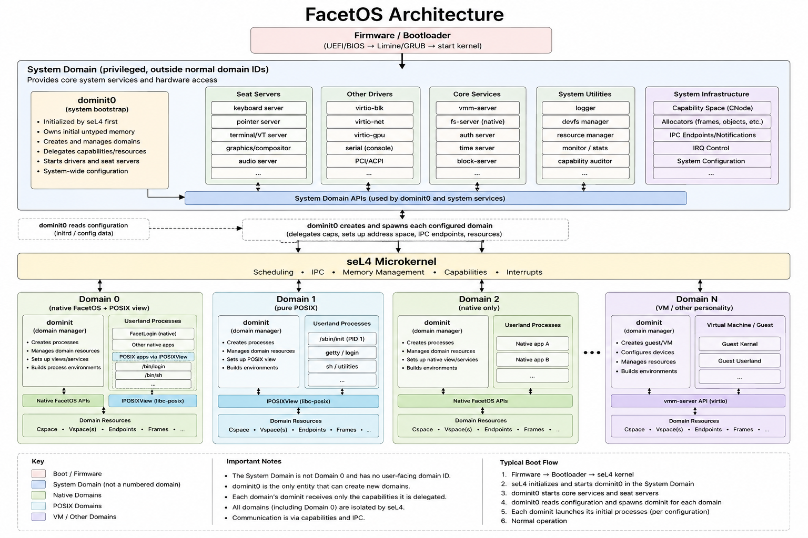

# FacetOS

FacetOS is a capability-oriented seL4 system. `dominit0` parses `config/facet.toml`, starts seat servers, and creates configured domains. Each domain receives a typed `IDomainEnvironment`; platform-specific seL4 state stays behind dominit0 and the platform launcher.

The default configuration has native domain 0 on serial `seat0.ttyS0` and local `seat1.tty1`. Local `seat1.tty2` is a POSIX view of domain 0: it runs `/bin/login` with only `IPOSIXView`, never native process/auth/filesystem capabilities. Its `/etc` is virtual and synthesized by dominit0; it is not present in `system.initrd`. `seat1.tty3` is domain 1, a pure POSIX domain whose `/sbin/init` is PID 1 and whose `child.initrd` contains its own `/etc`.

## Architecture

## Build and run

Run `make build` to build the kernel, services, applications, and initrds. Use a bounded boot such as `make run TIMEOUT=20`; always supply `TIMEOUT` so QEMU cannot remain running. `make test` runs host checks.

Native applications live in `src/apps/native`; POSIX applications live in `src/apps/posix`. POSIX programs use ordinary SysV `main`, while their CRT obtains the per-process `IPOSIXView` from FacetOS auxv. Add a POSIX target to `src/posix/CMakeLists.txt` and package it into the required initrd rule in `Makefile`.

## Configuration

`config/facet.toml` defines users, seats, domains, initrds, logging, and terminal assignments. Native terminal entries select an initial process and view. A POSIX domain names `pid1` and device-backed terminal assignments. The default development password for both configured accounts is `facetos`; its SHA-256 value is used by the prototype login implementation.
